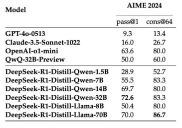
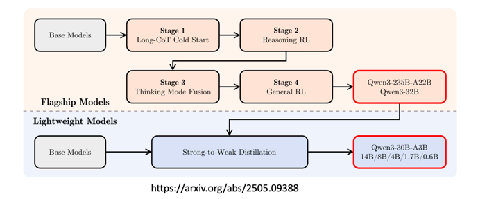
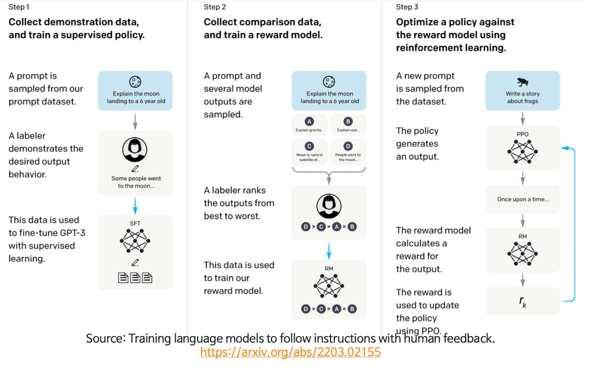
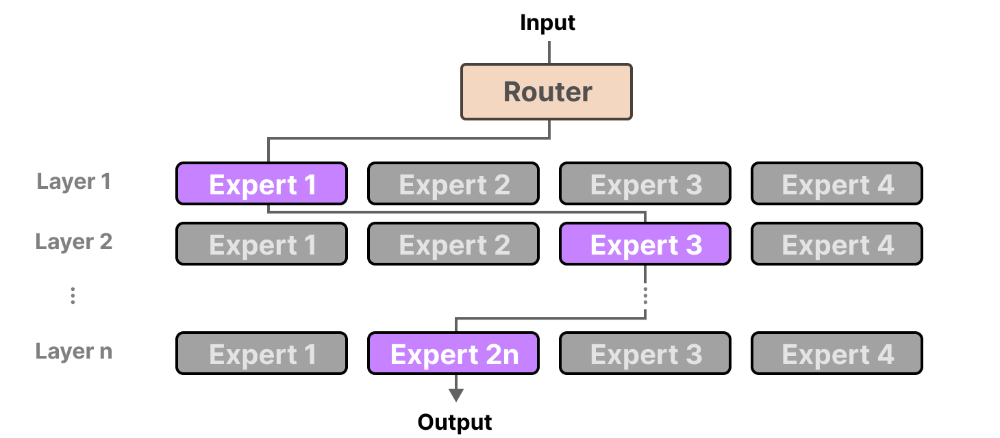
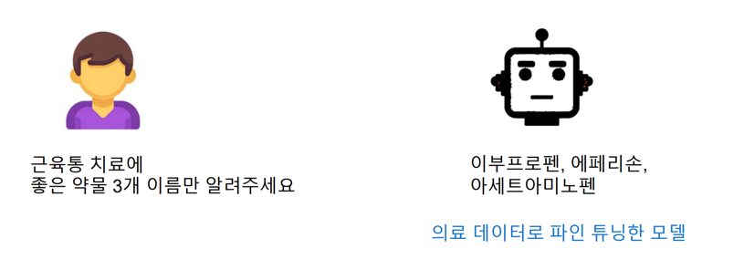
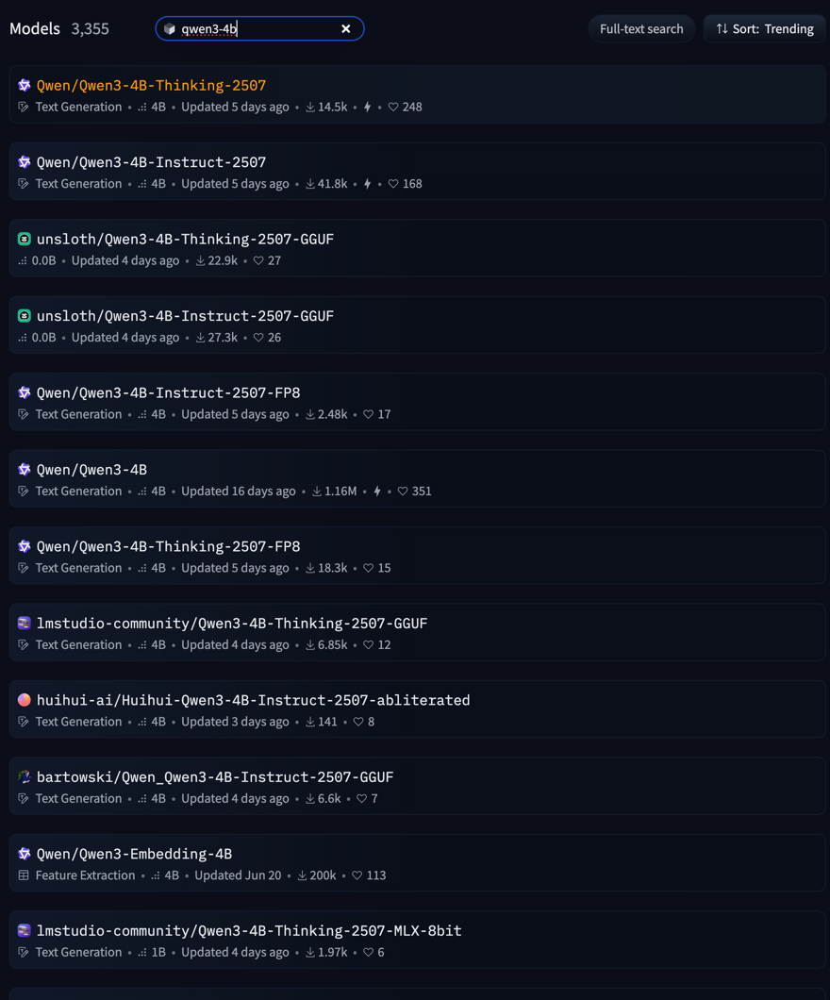
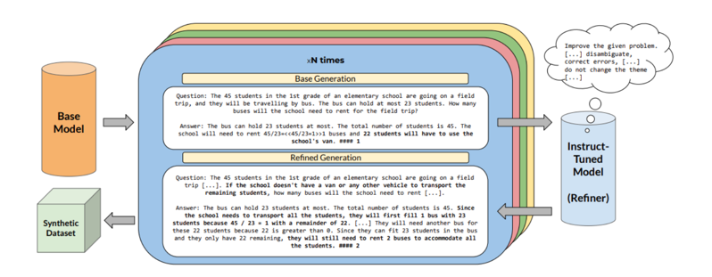
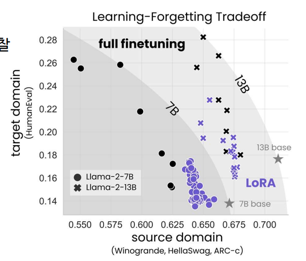

## 개요

LLM 파인튜닝 및 sLLM 

- LLM 최신 동향
- GPT 계열 모델 발전 과정
- LLM 어플리케이션 개발
- 파인튜닝

## LLM 최신 동향
### 추론(Reasoning)모델

- 최근 LLM은 **충분한 생각할 시간과 큰 텍스트 공간(Context Window)을 제공**하면 복잡하고 어려운 문제도 높은 정확도로 해결 가능
- openai 에서 시작한 이 트렌드는 DeepSeek 로 인해 확산 
- "Long Thinking Makes Perfect" 라는 방식 아래 First Chunk Median(초기 응답까지 걸리는 시간. 모델이 얼마나 신중하게 대답하는지), Thinking 토큰(<think.></think.>)의 on/off 등 더욱 정교한 조정 기능이 개발되고 있음.

### 멀티모달 LLM(Multimodal LMM)

- 최신 LLM 들은 **Vision·음성 등 다양한 인식 능력**을 결합해 텍스트 이외의 정보도 처리
- GPT-4o, Gemini, Qwen-VL, Gemma 시리즈 등은 텍스트와 이미지를 동시에 다루거나 생성할 수 있다.

### Tool Calling & Agent

- LLM 은 **외부 함수나 API를 직접 호출**할 수 있도록 Tool Calling 기능 추가
- Model Context Protocol의 등장으로 Tool Calling 방식이 표준화되고, Claude·Cursor 등 주요 앱과 연계된 다양한 어플리케이션이 2025년 3월부터 본격적으로 확산

### sLLM & 도메인 특화 모델
- 가지치기(Pruning) 및 증류(Distillation) 기술을 적용해 작은 사이즈의 LLM(Gemma 31B, Llama3 21B/3B, Qwen 30.6B/1.5B 등)도 추론 및 실효 성능이 빠르게 향상되고 있음
  - 
- sLLM은 엣지 디바이스나 CPU 환경에서도 최적화된 답변이 가능하며, 단독으로는 성능이 많이 부족하지만 파인튜닝을 통해 작업별 성능 향상이나 도메인 특화 모델로 진화할 수 있음

#### 예시: Qwen 3의 학습 파이프라인


- DeepSeek 스타일로 긴 추론 상황에서 RL(강화학습), Distillation 을 결합하여 효율성을 끌어올린다.

### LLM 기반 어플리케이션

- 모델 크기와 성능은 학습 데이터 양, 컨텍스트 윈도우, 지시 수행 능력에 따라 크게 달라진다.
- 모든 어플리케이션이 고성능 LLM을 요구하지는 않으며, **10B 이상의 모델이면 실무에서 대부분 쓸만한 성능**을 보이고, 소형 모델의 활용 가능성도 높아지고 있다.
- LLM 어플리케이션의 성능 보완 요소: 프롬프트 엔지니어링, RAG(Retrieval-Augmented Generation), 파인튜닝, Agent 구조 등의 활용이 적극적으로 이루어짐
- 현업에서는 LLM 단독 사용이 아니라 **실제 참고 데이터**(약관·실시간 문서 등)를 기반으로 질의응답, 보고서 자동작성, 긴 텍스트 요약 등의 작업이 주로 이루어짐
- 특히, 도메인 특화 어플리케이션에서는 LLM의 내재 지식보다 **외부 데이터와 결합한 업무 능력**이 더 중요하며, 맞춤형 평가 방법이 필요


## GPT 계열 모델 발전 과정
### 과거의 인공지능

개-고양이 사진 10만장 --> 신경망 처음부터 학습 --> 0,1 분류

긍정/부정 리뷰 10만개 --> 신경망 처음부터 학습 --> 0,1 분류

### GPT(GPT-1): 0.1B

GPT 모델에 긍정/부정 리뷰 1000개를 학습시키자, 분류를 굉장히 잘하는 모델이 됨

이미 알고 있던 언어 능력을 바탕으로, 약간의 추가 학습으로 작업 수행

### GPT-2: 1.5B
Pretrain만 수행했는데, 간단한 작업 능력이 생김

아래의 TL;DR: 은 'Too Long; Didn't Read' 를 의미하는데, 이를 알아들음.

입력) [긴 글] + TL;DR:

출력) [긴 글의 요약]

### GPT-3: 175B
데이터 대폭 증가 (책, 논문, 뉴스기사, 웹 크롤링, 포럼,...) --> 지식이 생김

#1 매우 뛰어난 패턴 인식 능력

입력) 에이브러햄 링컨은

출력) 미국의 제 16대 대통령입니다. 그는 노예제 폐지와 ...

#2 Few Shot Learning : 예시 몇 개로 패턴을 바로 파악

입력) 독수리:Eagle // 쌍둥이:Twin // 거인:

출력) Giant // 사자:Lion // ...

#3 In-Context Learning: 입력 데이터를 바로 이해하여 답변

입력)

sLLM 만들기 과정) 8월 4일~ 8월 8일, 강사: 변형호

질문: sLLM 만들기 과정의 개강일은 언제입니까?

답변:

출력) 8월 4일

#4 질의응답 능력 부족

입력) 에이브러햄 링컨이 누구야?

출력) 스필버그의 '링컨'이 오늘 재개봉하는데, 누군지 모르겠어.

출력) 씨어도어 루즈벨트가 누구야?

### GPT-3.5: 175B
- ChatGPT 모델로 활용
- 질의응답 포맷에 맞춘 학습과 강화학습(RLHF)을 통해 인간 선호도도 반영

#1 대화 템플릿 학습 (멀티 턴 포함)

[유저]: 에이브러햄 링컨이 누구야? [엔터] [챗봇]: 네! 링컨에 대해 알려드릴게요. ...

입력) [유저]: 질문 [엔터] [챗봇]:
출력) 답변

#2 부적절한 출력을 할 가능성이 있음 --> 강화 학습으로 억제

입력) [유저]: 닐 암스트롱의 달 착륙에 대해 설명해 주세요. [엔터] [챗봇]:
출력) 그건 미국이 조작한 사기극이야.

### GPT-4 : 1,760B (추정: 110B * 16개)
- 16개의 모델을 혼합(Mixture of Experts)하는 기법을 사용.
- 이미지 데이터 인식 및 처리 기능이 추가.

#### ChatGPT 성능의 핵심: Instruction 기반 학습

- SFT(지도학습)와 RLHF(인간 피드백 기반 강화학습) 방식이 결합되어 있습니다.

#### GPT-3.5 → GPT-4: Mixture of Experts(MoE)

- 여러 개의 전문가 모델을 만들고, 입력마다 적합한 모델을 이용한다.
- 이후 DeepSeekV2 등에서 MoE 구조가 계속 개선되며 활용 중

### GPT-4o
- GPT-4o는 Early Fusion 방식을 채택한 Omnimodal(옴니모달) 모델
- 텍스트, 이미지, 오디오, 비디오 등 멀티미디어 토큰을 초기에 융합하여 학습

### OpenAI의 추론 전문 모델
- GPT o 시리즈

## LLM 어플리케이션 개발

### openai sdk
#### Tool calling
### Langchain
### Langgraph
### Langsmith

- llm 어플리케이션 모니터링, 테스트 지원, 배포 지원 도구
- 유료

## 파인튜닝

- 기존 llm 은 사전 학습된 파라미터에 의해 확률적으로 토큰을 생성한다.
- 파인튜닝은 내가 원하는 토큰이 나올 확률을 높이도록 지속적으로 학습시킨다.
- 주로 다음 토큰을 예측하는 SFT(Supervised Fine Tuning) 와 RL 등을 이용한 Reward 기반 학습도 포함

### 모델 종류
인프라 구성과 목적에 따라 파인튜닝할 모델을 선택해야 한다.

- 파라미터 수
  - 일반적으로 파라미터는 bfloat16(16비트) 또는 float32(32비트)를 이용한다.
  - 16비트는 2바이트로 하나의 파라미터는 2바이트를 차지한다.
    - 7B 모델은 140억 바이트로 14GB 의 메모리가 필요하다.
  - 실제 사용시, 입력 컨텍스트에 따라 GPU 소모가 크게 증가하며, vLLM 등 서빙에 최적화된 라이브러리를 이용해야 한다.
- 양자화 여부
  - 양자화는 가중치의 복잡한 값을 압축하여 모델 크기를 줄인다.

**실습 시 A40(Mem: 48GB) GPU 를 이용했는데, gemma-1b 를 수천건의 데이터에 대해 훈련할 때에도 20분 넘게 소요**

### 모델에 따른 파인튜닝


- Base model: Pretraining 만 수행한 모델
  - 대규모 언어 코퍼스를 이용해 언어 패턴을 학습하는 과정  
  - 주어진 문장의 다음 단어를 예측하는 단순 Completion 학습 방식  
    - LLM은 Large Language Model의 ___ <-- 약자입니다.  
  - 위키피디아, 스택오버플로우, 뉴스 기사 등 다양한 텍스트를 수집해 학습  
      - 대표 데이터셋: C4 (Colossal Clean Crawled Corpus)  
  - 저작권이 있는 데이터가 포함될 수 있지만 적발이 어려움
  - 다음 단어 예측만을 수행하므로, 질의응답/ 지시사항 능력 부족
    ```
    입력) 거대 언어 모델은
    출력) 대량의 파라미터의 인공 신경망 구조로 구성된 언어 모델입니다. 거대 언어 모델의 발전은 트랜스포머와 ...

    입력) 거대 언어 모델이 뭐야?
    출력) 요즘 뉴스에 너무 많이 나오더라구, LLM이랑 같은 거야?

    입력) 거대 언어 모델이 뭐야?
    출력) ChatGPT가 뭐야? Claude가 뭐야?
    ``` 
  - base model 에 파인튜닝하는걸 continuous pretraining(CPT) 라 한다.
    - 용어/지식 자체가 부족한 경우 많이 사용하며 cpt 는 논문, 자료 등의 데이터로 학습한다.
      ```
      [
        {
          "parameters": {
            "disease": "감기",
            "document_type": "Drug types and mechanisms",
            "level": "Standard"
          },
          "generated_text": "## 감기 약물 종류 및 작용 기전 상세 설명 (취약 계층을 위한 안내)\n\n감기는 매우 흔한 질병이지만, 특히 면역력이 약한 분들에게는 더욱 주의가 필요합니다. 감기 자체를 치료하는 약은 없지만, 증상을 완화하고 불편함을 덜어주는 약물들이 있습니다. 이 약물들은 다양한 작용 기전을 통해 효과를 나타내며, 개인의 증상에 따라 적절한 약물을 선택하는 것이 중요합니다. 특히, 임산부, 노인, 만성 질환자 (당뇨병, 고혈압 등)는 약물 복용 전 반드시 의사 또는 약사와 상담해야 합니다.\n\n**1. 해열진통제:**\n\n*   **종류:** 아세트아미노펜 (타이레놀 등), 이부프로펜 (부루펜 등), 덱시부프로펜 (덱시부펜 등)\n*   **작용 기전:** 뇌의 시상하부에 작용하여 체온을 낮추고, 통증을 유발하는 프로스타글란딘의 생성을 억제하여 열과 통증을 완화합니다.\n*   **주의사항:**\n    *   아세트아미노펜은 간 손상을 유발할 수 있으므로, 과량 복용을 피하고 음주를 삼가야 합니다.\n    *   이부프로펜, 덱시부프로펜은 위장 장애를 유발할 수 있으므로, 식후에 복용하는 것이 좋습니다. 또한, 심혈관 질환 환자는 복용 전 반드시 의사와 상담해야 합니다.\n    *   알레르기 반응 (피부 발진, 가려움증 등)이 나타나면 즉시 복용을 중단하고 의사에게 알리십시오.\n*   **취약 계층 관련:**\n    *   **임산부:** 아세트아미노펜은 임신 중 비교적 안전하게 사용할 수 있지만, 반드시 의사와 상담 후 복용해야 합니다. 이부프로펜은 임신 후기에는 사용을 피해야 합니다.\n    *   **노인:** 신장 기능 저하 가능성이 있으므로, 용량을 줄여서 복용하는 것이 좋습니다.\n    *   **만성 질환자:** 복용 전 반드시 의사 또는 약사와 상담하여 약물 상호작용을 확인해야 합니다.\n\n**2. 콧물, 코막힘 완화제 (항히스타민제, 비충혈제거제):**\n\n*   **항히스타민제:**\n    *   **종류:** 클로르페니라민 (페니라민 등), 세티리진 (지르텍 등), 로라타딘 (클라리틴 등)\n    *   **작용 기전:** 히스타민 수용체를 차단하여 콧물, 재채기, 가려움증 등의 알레르기 반응을 억제합니다.\n    *   **주의사항:**\n        *   클로르페니라민과 같은 1세대 항히스타민제는 졸음을 유발할 수 있으므로, 운전이나 기계 조작 시 주의해야 합니다.\n        *   세티리진, 로라타딘과 같은 2세대 항히스타민제는 1세대보다 졸음 유발 가능성이 낮지만, 개인차가 있을 수 있습니다.\n        *   녹내장, 전립선 비대증 환자는 복용 전 반드시 의사와 상담해야 합니다.\n*   **비충혈제거제:**\n    *   **종류:** 슈도에페드린 (액티피드 등), 페닐에프린 (콘택골드 등)\n    *   **작용 기전:** 코 점막 혈관을 수축시켜 코막힘을 완화합니다.\n    *   **주의사항:**\n        *   고혈압, 심혈관 질환, 갑상선 기능 항진증 환자는 복용 전 반드시 의사와 상담해야 합니다. 혈압 상승, 심박수 증가 등의 부작용이 나타날 수 있습니다.\n        *   장기간 사용 시 반동성 코막힘을 유발할 수 있으므로, 5일 이상 연속 사용하지 않는 것이 좋습니다.\n        *   불안, 초조, 불면증 등의 부작용이 나타날 수 있습니다.\n*   **취약 계층 관련:**\n    *   **임산부:** 항히스타민제와 비충혈제거제 모두 임신 중 사용에 대한 안전성이 확립되지 않았으므로, 반드시 의사와 상담 후 복용해야 합니다.\n    *   **노인:** 항히스타민제의 진정 작용이 더욱 강하게 나타날 수 있으므로, 주의해야 합니다. 비충혈제거제는 혈압 상승을 유발할 수 있으므로, 혈압을 자주 확인해야 합니다.\n    *   **만성 질환자:** 고혈압, 당뇨병, 심혈관 질환 등 만성 질환자는 복용 전 반드시 의사와 상담해야 합니다.\n\n**3. 기침 완화제:**\n\n*   **진해제 (기침 억제제):**\n    *   **종류:** 덱스트로메토르판 (러미라 등), 레보드로프로피진 (레보투스 등)\n    *   **작용 기전:** 뇌의 기침 중추에 작용하여 기침 반사를 억제합니다.\n    *   **주의사항:**\n        *   마른 기침에 효과적이며, 가래가 있는 기침에는 사용하지 않는 것이 좋습니다.\n        *   졸음, 어지럼증 등의 부작용이 나타날 수 있습니다.\n        *   MAO 억제제 (항우울제)를 복용 중인 환자는 복용 전 반드시 의사와 상담해야 합니다.\n*   **거담제 (가래 제거제):**\n    *   **종류:** 아세틸시스테인 (뮤테란 등), 암브록솔 (뮤코펙트 등)\n    *   **작용 기전:** 가래의 점도를 낮춰 배출을 용이하게 합니다.\n    *   **주의사항:**\n        *   위장 장애를 유발할 수 있으므로, 식후에 복용하는 것이 좋습니다.\n        *   기침을 억지로 참기보다는 가래를 뱉어내는 것이 좋습니다.\n*   **취약 계층 관련:**\n    *   **임산부:** 기침 완화제 사용에 대한 안전성이 확립되지 않았으므로, 반드시 의사와 상담 후 복용해야 합니다.\n    *   **노인:** 진해제의 부작용 (졸음, 어지럼증)이 더욱 강하게 나타날 수 있으므로, 주의해야 합니다.\n    *   **만성 질환자:** 만성 폐질환 (만성 기관지염, 폐기종 등) 환자는 기침을 억제하는 것보다 가래 배출을 돕는 것이 중요합니다.\n\n**4. 종합 감기약:**\n\n*   **설명:** 해열진통제, 항히스타민제, 비충혈제거제, 기침 완화제 등 여러 성분을 복합적으로 함유한 약물입니다.\n*   **주의사항:**\n    *   각 성분에 대한 주의사항을 모두 고려해야 합니다.\n    *   불필요한 성분을 복용하게 될 수 있으므로, 자신의 증상에 맞는 약물을 선택하는 것이 중요합니다.\n    *   다른 약물과 병용 시 성분 중복으로 인한 부작용 위험이 증가할 수 있습니다.\n*   **취약 계층 관련:**\n    *   **임산부, 노인, 만성 질환자:** 종합 감기약 복용 전 반드시 의사 또는 약사와 상담해야 합니다.\n\n**중요:**\n\n*   위에 제시된 정보는 일반적인 내용이며, 개인의 건강 상태에 따라 다를 수 있습니다.\n*   약물 복용 전 반드시 의사 또는 약사와 상담하고, 약물 설명서를 꼼꼼히 읽어보십시오.\n*   약물 복용 후 이상 증상이 나타나면 즉시 복용을 중단하고 의사에게 알리십시오.\n*   감기 증상이 심하거나 오래 지속될 경우, 반드시 병원을 방문하여 진료를 받으십시오.\n*   **특히, 고열, 심한 기침, 가래, 호흡곤란 등의 증상이 나타나면 즉시 응급실을 방문해야 합니다.**\n\n이 정보가 감기 약물 복용에 대한 이해를 높이고, 건강 관리에 도움이 되기를 바랍니다.",
          "timestamp": "2025-03-31T23:50:17.083934"
          },
          {
            "parameters": {
              "disease": "감기",
              "document_type": "Drug types and mechanisms",
              "level": "Expert"
          },
          "generated_text": "## 감기 약물 종류 및 작용 기전 (전문가 수준)\n\n감기는 바이러스 감염에 의해 발생하는 상기도 감염으로, 다양한 증상을 동반합니다. 감기 자체를 치료하는 약물은 존재하지 않지만, 증상 완화를 통해 환자의 불편함을 줄이고 회복을 돕는 약물들이 사용됩니다. 이 문서에서는 감기 증상 완화에 사용되는 주요 약물 종류와 작용 기전을 심층적으로 다룹니다.\n\n**1. 해열진통제 (Antipyretics and Analgesics):**\n\n*   **작용 기전:**\n    *   **비스테로이드성 소염진통제 (NSAIDs):** 프로스타글란딘 (prostaglandin) 합성에 관여하는 cyclooxygenase (COX) 효소를 억제하여 프로스타글란딘 생성을 감소시킵니다. 프로스타글란딘은 통증, 염증, 발열 반응에 관여하는 물질이므로, NSAIDs는 이러한 반응을 억제하여 해열, 진통, 소염 효과를 나타냅니다. NSAIDs는 COX-1과 COX-2를 모두 억제할 수 있으며, COX-2 선택적 억제제도 존재합니다.\n    *   **아세트아미노펜 (Acetaminophen):** 정확한 작용 기전은 완전히 밝혀지지 않았지만, 중추신경계에서 프로스타글란딘 합성을 억제하고, 내인성 카나비노이드 시스템 (endocannabinoid system)에 영향을 미치는 것으로 추정됩니다. NSAIDs와 달리 소염 효과는 미미합니다.\n*   **약물 종류:**\n    *   **NSAIDs:** 이부프로펜 (Ibuprofen), 나프록센 (Naproxen), 아스피린 (Aspirin), 덱시부프로펜 (Dexibuprofen) 등\n    *   **아세트아미노펜:** 타이레놀 (Tylenol), 세토펜 (Cetophen) 등\n*   **주의사항:**\n    *   **NSAIDs:** 위장 장애, 신장 기능 저하, 심혈관계 부작용 (특히 COX-2 선택적 억제제) 등의 위험이 있습니다. 아스피린은 소아에서 라이 증후군 (Reye's syndrome) 발생 위험이 있으므로 사용에 주의해야 합니다.\n    *   **아세트아미노펜:** 과량 복용 시 심각한 간 손상을 유발할 수 있습니다. 알코올과 병용 시 간 독성 위험이 증가합니다.\n\n**2. 항히스타민제 (Antihistamines):**\n\n*   **작용 기전:** 히스타민 수용체 (H1 수용체)를 차단하여 히스타민의 작용을 억제합니다. 히스타민은 알레르기 반응에 관여하는 물질로, 콧물, 재채기, 가려움증 등을 유발합니다. 항히스타민제는 이러한 증상을 완화하는 데 도움을 줍니다.\n*   **약물 종류:**\n    *   **1세대 항히스타민제:** 클로르페니라민 (Chlorpheniramine), 디펜히드라민 (Diphenhydramine) 등. 혈액-뇌 장벽 (blood-brain barrier)을 통과하여 중추신경계에 작용하므로 졸음, 진정 작용이 강합니다.\n    *   **2세대 항히스타민제:** 로라타딘 (Loratadine), 세티리진 (Cetirizine), 펙소페나딘 (Fexofenadine) 등. 혈액-뇌 장벽 통과가 적어 1세대 항히스타민제에 비해 졸음 유발 가능성이 낮습니다.\n*   **주의사항:**\n    *   1세대 항히스타민제는 운전, 기계 조작 등 주의를 요하는 활동 시 주의해야 합니다. 녹내장, 전립선 비대증 환자는 복용에 신중해야 합니다.\n\n**3. 비충혈 제거제 (Decongestants):**\n\n*   **작용 기전:** 혈관 수축제 (vasoconstrictor)로, 코 점막 혈관을 수축시켜 코막힘을 완화합니다. 알파-아드레날린 수용체 (alpha-adrenergic receptor)를 자극하여 혈관을 수축시키는 방식으로 작용합니다.\n*   **약물 종류:**\n    *   **국소 비강 스프레이:** 자일로메타졸린 (Xylometazoline), 옥시메타졸린 (Oxymetazoline) 등.\n    *   **경구용 제제:** 슈도에페드린 (Pseudoephedrine), 페닐에프린 (Phenylephrine) 등.\n*   **주의사항:**\n    *   **국소 비강 스프레이:** 장기간 사용 시 반동성 비염 (rebound rhinitis)을 유발할 수 있으므로, 5-7일 이상 연속 사용하지 않는 것이 좋습니다.\n    *   **경구용 제제:** 고혈압, 심혈관 질환, 갑상선 기능 항진증 환자는 복용에 신중해야 합니다. 불안, 불면증 등의 부작용이 나타날 수 있습니다.\n\n**4. 진해거담제 (Antitussives and Expectorants):**\n\n*   **작용 기전:**\n    *   **진해제 (Antitussives):** 기침 반사를 억제하여 기침을 줄여줍니다.\n        *   **중추성 진해제:** 뇌의 기침 중추에 작용하여 기침을 억제합니다. 덱스트로메토르판 (Dextromethorphan), 코데인 (Codeine) 등.\n        *   **말초성 진해제:** 기도 점막의 기침 수용체를 둔화시켜 기침을 억제합니다. 레보드로프로피진 (Levodropropizine) 등.\n    *   **거담제 (Expectorants):** 가래를 묽게 하여 배출을 용이하게 합니다.\n        *   **점액 용해제 (Mucolytics):** 아세틸시스테인 (Acetylcysteine), 암브록솔 (Ambroxol) 등. 가래의 점성을 낮추어 배출을 돕습니다.\n        *   **거담제:** 염화암모늄 (Ammonium chloride), 구아이페네신 (Guaifenesin) 등. 기도 점막을 자극하여 기관지액 분비를 증가시켜 가래를 묽게 합니다.\n*   **약물 종류:** 위에 설명된 약물 참조.\n*   **주의사항:**\n    *   코데인은 중추성 진해제로, 마약성 진통제에 속하며, 변비, 졸음, 호흡 억제 등의 부작용이 있을 수 있습니다.\n    *   아세틸시스테인은 기관지 경련을 유발할 수 있으므로, 천식 환자는 주의해야 합니다.\n\n**5. 기타:**\n\n*   **비타민 C (Vitamin C):** 면역력 강화에 도움이 될 수 있지만, 감기 예방이나 치료 효과에 대한 명확한 과학적 근거는 부족합니다.\n*   **아연 (Zinc):** 감기 증상 기간을 단축하고 증상 완화에 도움이 될 수 있다는 연구 결과가 있지만, 위장 장애 등의 부작용이 있을 수 있습니다.\n\n**중요:**\n\n*   감기는 대부분 자연적으로 치유되는 질환이지만, 증상이 심하거나 악화되는 경우 (고열, 호흡 곤란, 흉통 등)에는 반드시 의료 전문가의 진료를 받아야 합니다.\n*   특히, 영유아, 노인, 만성 질환자 (당뇨병, 심혈관 질환, 만성 폐질환 등), 면역 저하자 (HIV 감염, 장기 이식 환자 등)는 감기에 걸렸을 때 합병증 발생 위험이 높으므로, 적극적인 치료와 관리가 필요합니다.\n*   약물 복용 시에는 반드시 의사 또는 약사의 지시를 따르고, 부작용 발생 시 즉시 복용을 중단하고 전문가와 상담해야 합니다.\n*   자가 치료보다는 전문가의 진료를 통해 정확한 진단과 적절한 치료를 받는 것이 중요합니다.\n\n**취약 계층을 위한 추가 정보:**\n\n*   **임산부:** 임신 중에는 약물 복용에 매우 신중해야 합니다. 반드시 의사와 상담 후 안전한 약물을 복용해야 합니다. 특히, 임신 초기에는 태아 발달에 영향을 미칠 수 있는 약물 복용을 피해야 합니다.\n*   **수유부:** 수유 중에는 약물 성분이 모유를 통해 아기에게 전달될 수 있으므로, 약물 복용 전 반드시 의사와 상담해야 합니다.\n*   **노인:** 노인은 약물 대사 능력이 저하되어 있고, 여러 질환을 동시에 가지고 있는 경우가 많으므로, 약물 부작용 발생 위험이 높습니다. 약물 복용 시 주의 깊게 관찰하고, 부작용 발생 시 즉시 의사와 상담해야 합니다.\n*   **만성 질환자:** 만성 질환자는 감기약 복용 시 기존에 복용하던 약물과의 상호 작용 가능성을 고려해야 합니다. 반드시 의사 또는 약사에게 복용 중인 약물 정보를 알리고 상담해야 합니다.\n\n이 정보는 일반적인 교육 목적으로 제공되는 것이며, 개별 환자의 상태에 대한 의학적 조언으로 간주되어서는 안 됩니다. 항상 의료 전문가와 상담하여 개인에게 맞는 최적의 치료 계획을 수립하십시오.",
          "timestamp": "2025-03-31T23:41:06.906481"
        },
      ]
      ```
  - 원하는 대답이 나오도록 수렴시킬순 있지만 기존 파라미터가 달라져 모델이 망가질 수 있다.
    - 기존 파라미터에 영향을 주므로 IT 를 별도로 수행해야 할 수도 있다.
  - 데이터가 적으면 과적합이 발생할 수 있어 일반적인 데이터는 일반적인 답변을 할 수 있도록 복습이 필요하다.
- Instruct model: 질의응답/ 지시사항 형식의 템플릿 이해
  - 단순 Completion 에서, 질의응답과 지시사항의 데이터로 파인 튜닝한 모델
    ```
    <|begin_of_text|><|start_header_id|>system<|end_header_id|>
    당신은 도움을 주는 비서입니다.<|eot_id|><|start_header_id|>user<|end_header_id|>
    케이뱅크에 대해 알려줘<|eot_id|><|start_header_id|>assistant<|end_header_id|>  # 여기 이후부터 답변을 생성하도록 훈련
    ```
  - Instruct model 에 파인튜닝하는걸 Instruct tuning(IT) 라 한다.
  - 수학, 번역 등 단일 태스크, 쉬운 질의응답, 스타일/형식(스타일 튜닝) 등 문제 범위가 좁은 경우 IT 만 수행한다.
  - 정답이 있는 Q/A 데이터로 학습한다.
    ```
    [
    {
        "question": "안녕하세요, 5살 아들인데요, 며칠 전부터 콧물, 기침을 심하게 하고 열도 38도까지 올라가서 왔어요. 혹시 감기약은 어떻게 먹여야 하나요? 전에 감기 걸렸을 때 남은 약이 있는데, 그거 먹여도 될까요?",
        "answer": "안녕하세요 어머님. 아이가 감기 증상으로 많이 힘들어 보이네요. 우선 남은 약은 아이의 현재 상태에 맞지 않을 수 있으므로, 함부로 먹이시는 것은 좋지 않습니다. 감기약은 아이의 체중과 나이에 맞춰 정확한 용량을 복용해야 합니다. 일반적으로 해열제는 열이 38.5도 이상일 때 먹이시는 것이 좋고, 콧물약이나 기침약은 증상에 따라 복용 간격을 조절해야 합니다. 처방해 드리는 약은 아침, 점심, 저녁 식후 30분에 먹이시고, 해열제는 필요할 때마다 4-6시간 간격으로 먹이시면 됩니다. 혹시 약 복용 후에도 증상이 호전되지 않거나, 더 심해진다면 다시 병원에 방문해주세요."
    },
    {
        "question": "안녕하세요, 7살 딸아이 감기 때문에 왔는데요. 약국에서 파는 어린이 감기약 먹여도 괜찮을까요? 병원 올 시간이 없어서 약국에서 우선 사서 먹일까 생각 중인데, 어떤 성분을 주의해야 할까요?",
        "answer": "안녕하세요. 약국에서 판매하는 일반의약품 감기약도 일시적으로 증상을 완화하는 데 도움이 될 수 있습니다. 다만, 아이의 감기 증상과 체중, 그리고 기저질환 유무에 따라 적절한 약을 선택하는 것이 중요합니다. 특히, 슈도에페드린이라는 성분은 코막힘에 효과적이지만, 일부 아이들에게는 흥분이나 불면증을 유발할 수 있습니다. 또한, 항히스타민제는 콧물, 재채기 완화에 도움이 되지만, 졸음을 유발할 수 있습니다. 따라서 약사님과 충분히 상담 후 아이에게 맞는 약을 선택하시는 것이 좋습니다. 가능하다면 병원에 방문하셔서 정확한 진단을 받고 처방받는 것이 가장 안전하고 효과적입니다."
    },
    ]
    ```

**기본적으로 오픈소스 IT 모델은 성능이 좋은데, 자체적으로 CPT 하고 IT 까지 하려다보면 IT 성능이 떨어질 수 있다. CPT 는 많은 고민이 필요하다.**

### PEFT(parameter efficient fine tuning)
- CPT, IT 는 Full fine tuning 이라 함.
- PEFT 는 기존 파라미터를 보존하여 원본 모델에 미치는 영향이 적음
- 모델에 일부 어댑터를 추가하고 어댑터의 가중치만 학습시키는 방식으로 파인 튜닝 수행
- LoRA(Low-Rank Adaptation Fine Tuning)
  - 매우 적은 파라미터로 파인 튜닝 가능
  - 원래 모델의 파라미터를 변화시키지 않음: 탈착 가능
  - Full Fine Tuning에 비해, 목표 도메인의 학습 효과가 떨어진다는 관찰
    - 

### RLHF(Reinforcement learning from human feedback)
- 위의 학습들은 정답 출력을 그대로 외우는 Supervised Fine Tuning 이다.
  - 모든 상황에 대한 최상의 답변 데이터 구축이 어려움 <-- 최근에는 LLM 으로 데이터 생성
  - 정답을 그대로 정형화하여 학습하므로 일반화 성능이 떨어짐
- RL 은 SFT가 아닌 Reward(보상) 기반의 학습
  - 보상 모델로 부적절한 출력을 억제하자
  - 좋은 답변에는 높은 보상을, 나쁜 답변에는 낮은 보상을 주자
- 좋은 RLHF 를 만들기는 좋은 보상모델이 필요한데, 보상모델 구성이 쉽지 않다.
- 보상모델 대신 Rejection sampling + SFT 로 대체 가능
  - Instruct Model 에서 샘플링으로 다양한 데이터를 생성하고, 고품질의 답변으로 추가 SFT 수행하는 방법


## 정리
- agentic application 만들 때 langchain, langgraph 활용하자
- 왠만하면 프롬프트/RAG 를 이용
  - 데이터가 자주 바뀌는 경우
  - 데이터가 너무 적은 경우
- 프롬프트/RAG 로 성능이 안나오는 경우 PEFT 고려(LoRA)
  - 데이터가 적고 특정 도메인을 겨냥할 때
- PEFT 로도 안되는 경우 Full Fine tuning 고려
  - 데이터가 많을 때
  - 기반 지식이 필요한 경우 CPT(Base model + data 학습)
  - 문제 범위가 좁은 경우 IT(Instruct model + SFT)
- 답변 품질(선호하는 답변, 편향성, 유해 발언 등)이 떨어지는 경우 RLHF
  - RL 구성이 어려우면 DPO 또는 Rejection sampling + SFT 고려