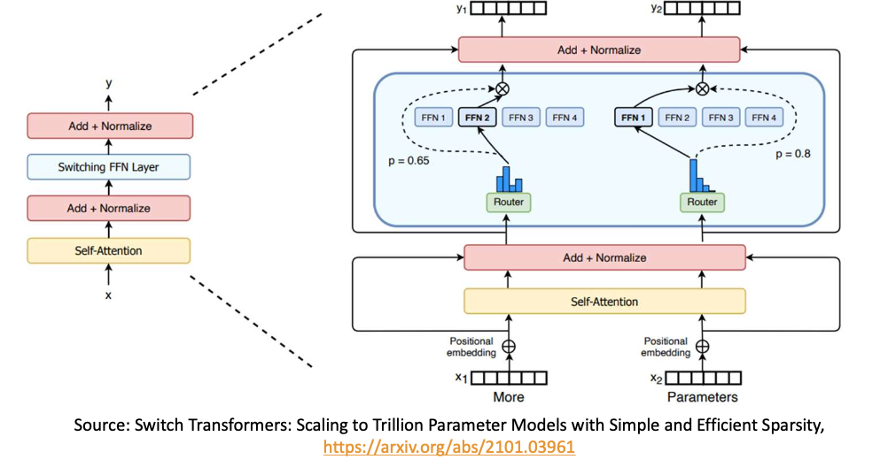
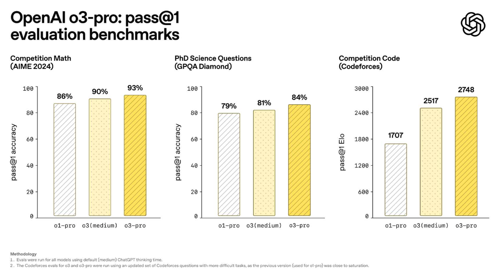

- 최신 동향
- gpt
- tool, parallel tool
- langchain, langgraph
- rag
- find tuning


## 최근 LLM 동향
### Reasoning

- 최근 LLM은 **충분한 생각할 시간과 큰 텍스트 공간(Context Window)을 제공**하면 복잡하고 어려운 문제도 높은 정확도로 해결 가능
- openai 에서 시작한 이 트렌드는 DeepSeek 등으로 확산되었으며, "Long Thinking Makes Perfect"라는 방식 아래 First Chunk Median(초기 응답까지 걸리는 시간), Thinking 토큰(<think> </think>)의 Budget 및 Hybrid 모드 등 더욱 정교한 조정 기능이 개발되고 있음.
- Thinking 모델인 o1 의 출력은 6개의 패턴으로 분류
  - Systematic Analysis : 전체적인 구조 파악
  - Method Reuse : 기존의 문제 해결법 적용
  - Divide and Conquer : 문제를 세분화하여 처리
  - Self-Refinement : 자체적으로 평가·수정
  - Context Identification : 추가적인 문맥을 적극적으로 활용
  - Emphasizing Constraints : 제약 조건을 강조

### 멀티모달 LLM(Multimodal LMM)

- 최신 LLM들은 **Vision·음성 등 다양한 인식 능력**을 결합해 텍스트 이외의 정보도 처리
- GPT-4o, Gemini, Qwen-VL, Gemma 시리즈 등은 텍스트와 이미지를 동시에 다루거나 생성할 수 있음

### Tool Calling & Agent

- LLM 은 **외부 함수나 API를 직접 호출**할 수 있도록 Tool Calling 기능 추가
- Model Context Protocol의 등장으로 Tool Calling 방식이 표준화되고, Claude·Cursor 등 주요 앱과 연계된 다양한 어플리케이션이 2025년 3월부터 본격적으로 확산

### sLLM & 도메인 특화 모델

- 가지치기(Pruning) 및 증류(Distillation) 기술을 적용해 **작은 사이즈의 LLM(Gemma 31B, Llama3 21B/3B, Qwen 30.6B/1.5B 등)**도 추론 및 실효 성능이 빠르게 향상되고 있음
- sLLM은 엣지 디바이스나 CPU 환경에서도 최적화된 답변이 가능하며, 단독으로는 성능이 많이 부족하지만 파인튜닝을 통해 작업별 성능 향상이나 도메인 특화 모델로 진화할 수 있음

#### 예시: Qwen 3의 학습 파이프라인


- Deepseek 는 
- 긴 추론 상황에서 Cold Start와 RL(강화학습), Distillation을 결합하여 DeepSeek 스타일의 효율성을 끌어올립니다.

### LLM 기반 어플리케이션

- 모델 크기와 성능은 학습 데이터 양, 컨텍스트 윈도우, 지시 수행 능력에 따라 크게 달라집니다.
- 모든 어플리케이션이 고성능 LLM을 요구하지는 않으며, **10B 이상의 모델이면 실무에서 대부분 쓸만한 성능**을 보이고, 소형 모델의 활용 가능성도 높아지고 있습니다.
- LLM 어플리케이션의 성능 보완 요소: 프롬프트 엔지니어링, RAG(Retrieval-Augmented Generation), 파인튜닝, Agent 구조 등의 활용이 적극적으로 이루어지고 있습니다.

### LLM을 활용한 업무 프로세스 및 실제 적용

- 비정형 텍스트 데이터의 이해와 처리 역량이 중요하며, 데이터 전처리 과정은 기업의 AI 전환(AX)에서 어려운 대표 요인입니다.
- 현업에서는 LLM 단독 사용이 아니라 **실제 참고 데이터**(약관·실시간 문서 등)를 기반으로 질의응답, 보고서 자동작성, 긴 텍스트 요약 등의 작업이 주로 이루어집니다.
- 특히, 도메인 특화 어플리케이션에서는 LLM의 내재 지식보다 **외부 데이터와 결합한 업무 능력**이 더 중요하며, 맞춤형 평가 방법이 필요할 수 있습니다.


## GPT 계열 모델 발전 과정

### GPT(GPT-1) : 0.1B 파라미터
- 특정 도메인에 적용하려면 후처리(Fine-tuning)가 필요합니다.
- 예시: 리뷰 데이터에 레이블을 추가한 후 학습을 진행하여 긍정/부정 분류 작업에 활용할 수 있습니다.

### GPT-2 : 1.5B 파라미터
- 다양한 일반 도메인에 범용적으로 적용하려는 시도가 이루어졌습니다.
- 예시: 간단한 요약, 번역 등의 작업을 언어로 전달하는 기능을 갖추고 있습니다.

### GPT-3 : 175B 파라미터
- 대량의 데이터로 인해 높은 수준의 지식과 언어 능력을 보여주었습니다.
- In-Context Learning 및 Few-Shot Learning 능력을 발견하였습니다.
- 질의응답 능력은 다소 부족한 편입니다.

### GPT-3.5 : 175B 파라미터
- ChatGPT 모델로 활용됩니다.
- 질의응답 포맷에 맞춘 학습과 강화학습(RLHF)을 통해 인간 선호도도 반영하였습니다.

### GPT-4 : 1,760B 파라미터 (추정: 110B * 16개)
- 16개의 모델을 혼합(Mixture of Experts)하는 기법을 사용합니다.
- 이미지 데이터 인식 및 처리 기능이 추가되었습니다.
    - Vision Encoder를 통해 이미지를 인코딩하고 결합할 수 있습니다.
- 웹검색, DALL·E 3, Code Interpreter 등 다양한 기능이 추가되었습니다.


#### ChatGPT 성능의 핵심: Instruction 기반 학습

- SFT(지도학습)와 RLHF(인간 피드백 기반 강화학습) 방식이 결합되어 있습니다.

#### GPT-3.5 → GPT-4: Mixture of Experts(MoE)

- MoE 구조에서는 Self-Attention을 공유하며, 여러 개의 MLP 중 일부만 활성화됩니다.
- 라우터(Router) 모델이 N개의 MLP 중 일부를 선택해 처리합니다.
- 이후 DeepSeekV2 등에서 MoE 구조가 계속 개선되며 활용 중입니다.


### GPT-4o

- GPT-4o는 Early Fusion 방식을 채택한 Omnimodal(옴니모달) 모델입니다.
- 텍스트, 이미지, 오디오, 비디오 등 멀티미디어 토큰을 초기에 융합하여 학습합니다.
- Any-to-Any 모델 형태로, 현재는 텍스트/오디오/이미지 생성 기능이 개별적으로 공개되어 있습니다.
- 토크나이저 성능이 대폭 개선되어 한국어 등 다국어 데이터 처리 속도가 증가했습니다.
- 자세한 내용은 OpenAI 공식 안내를 참고해 주세요.


### OpenAI의 추론 전문 모델

- 2025년 4월 25일 O4-mini 출시: 뛰어난 추론 및 도구 사용 능력을 보유하고 있습니다.
- 2025년 6월 OpenAI O3 Pro 출시.
- 추론 길이 설정 방식이 제공되며, Low/Medium/High 옵션을 선택할 수 있습니다.


## fine tuning

### 
- 새로운 데이터를 추가 학습하여 LLM의 성능을 향상시키는 방법
  - 주로 다음 토큰을 예측하는 SFT(SupervisedFineTuning)
  - RL 등을 이용한 Reward 기반 학습도 포함
- LLM Training 은 다양한 데이터에 대해서 모델을 처음부터 학습시키는 과정으로 이 단계를 

- Base model: Pretraining 만 수행한 모델
  - 대규모 언어 코퍼스를 이용해 언어 패턴을 학습하는 과정  
  - 주어진 문장의 다음 단어를 예측하는 단순 Completion 학습 방식  
    - LLM은 Large Language Model의 ___ <-- 약자입니다.  
  - 위키피디아, 스택오버플로우, 뉴스 기사 등 다양한 텍스트를 수집해 학습  
      - 대표 데이터셋: C4 (Colossal Clean Crawled Corpus)  
  - 저작권이 있는 데이터가 포함될 수 있지만 적발이 어려움
  - 다음 단어 예측만을 수행하므로, 질의응답/ 지시사항 능력 부족
    ```
    입력) 거대 언어 모델은
    출력) 대량의 파라미터의 인공 신경망 구조로 구성된 언어 모델입니다. 거대 언어 모델의 발전은 트랜스포머와 ...

    입력) 거대 언어 모델이 뭐야?
    출력) 요즘 뉴스에 너무 많이 나오더라구, LLM이랑 같은 거야?

    입력) 거대 언어 모델이 뭐야?
    출력) ChatGPT가 뭐야? Claude가 뭐야?
    ```
- Instruct model: 질의응답/ 지시사항 형식의 템플릿 이해
  - 단순 Completion에서, 질의응답과 지시사항의 데이터로 파인 튜닝한 모델
  ```
  <|begin_of_text|><|start_header_id|>system<|end_header_id|>
  당신은 도움을 주는 비서입니다.<|eot_id|><|start_header_id|>user<|end_header_id|> What can you help me with?<|eot_id|><|start_header_id|>assistant<|end_header_id|>
  ```

### 언제 파인 튜닝을 수행하는가?
- 지식: 최신 데이터나 도메인 특화 데이터에 대한 근본적 정보 학습  
- 능력: 방법은 알지만 잘하지 못하는 문제풀이 개선  
- 형식: 업무용 포맷, 출력 길이, 말투 등 다양한 스타일로 맞춤 출력  
- 안전: 유해 요청 거부, 유익한 응답 생성

### 오픈소스 LLM

- 학습 데이터를 제외한 모델 구조와 파라미터가 전부 공개된 모델로, 재현이 어려줘 완전한 오픈소스라 말하지는 않는다.
- 


### 모델 선택
- 파라미터 수
  - 일반적으로 파라미터는 bfloat16(16비트) 또는 float32(32비트)를 이용한다.
  - 16비트는 2바이트로 하나의 파라미터는 2바이트를 차지한다.
    - 7B 모델은 140억 바이트로 14GB 의 메모리가 필요하다.
  - 실제 사용시, 입력 컨텍스트에 따라 GPU 소모가 크게 증가하며, vLLM 등 서빙에 최적화된 라이브러리를 이용해야 한다.
- 양자화
  - 양자화는 가중치의 복잡한 값을 압축하여 모델 크기를 줄인다.