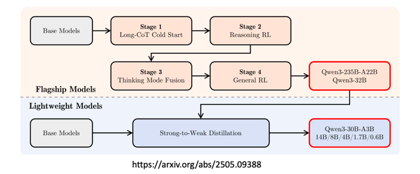
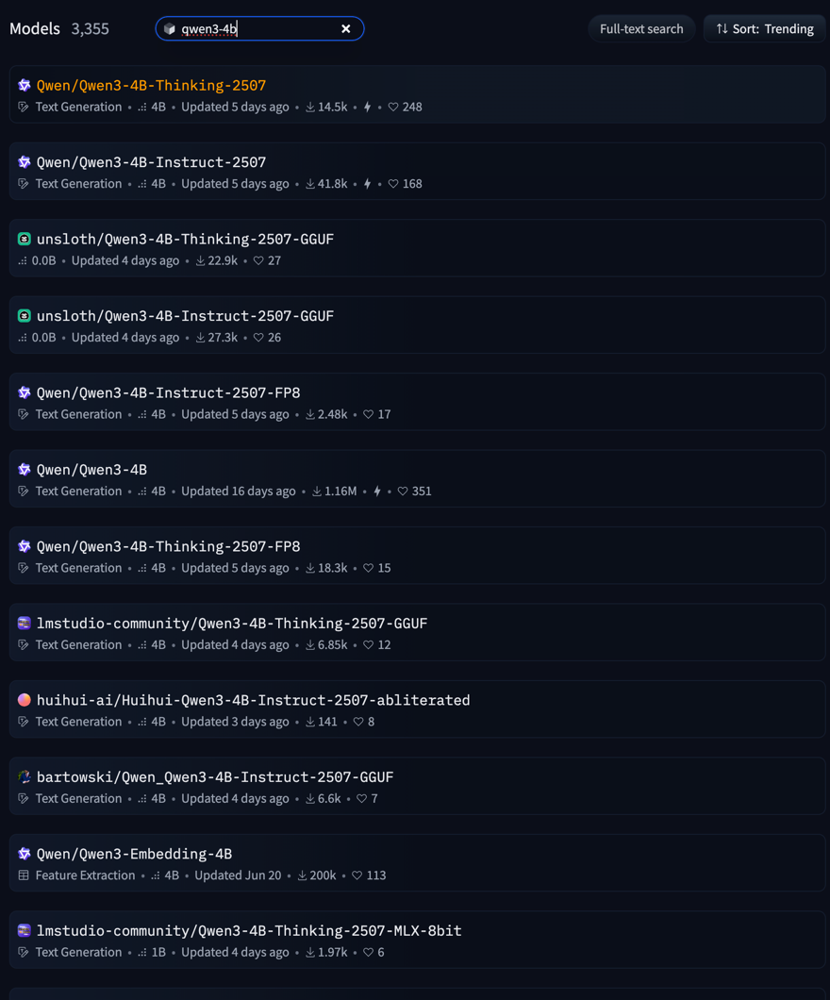

### 목차
- LLM 최신 동향
- GPT 계열 모델 발전 과정
- LLM 어플리케이션 개발
- 파인튜닝

---
## LLM 최신 동향

---
### 추론(Reasoning)모델


- 최근 LLM은 **충분한 생각할 시간과 큰 텍스트 공간(Context Window)을 제공**하면 복잡하고 어려운 문제도 높은 정확도로 해결 가능
- openai 에서 시작한 이 트렌드는 DeepSeek 로 인해 확산 
- "Long Thinking Makes Perfect" 라는 방식 아래 First Chunk Median(초기 응답까지 걸리는 시간. 모델이 얼마나 신중하게 대답하는지), Thinking 토큰(<think.></think.>)의 on/off 등 더욱 정교한 조정 기능이 개발되고 있음.

---

### 멀티모달 LLM(Multimodal LMM)

- 최신 LLM 들은 **Vision·음성 등 다양한 인식 능력**을 결합해 텍스트 이외의 정보도 처리
- GPT-4o, Gemini, Qwen-VL, Gemma 시리즈 등은 텍스트와 이미지를 동시에 다루거나 생성할 수 있다.

---
### LLM 기반 어플리케이션

- 모델 크기와 성능은 학습 데이터 양, 컨텍스트 윈도우, 지시 수행 능력에 따라 크게 달라진다.
- 모든 어플리케이션이 고성능 LLM을 요구하지는 않으며, **10B 이상의 모델이면 실무에서 대부분 쓸만한 성능**을 보이고, 소형 모델의 활용 가능성도 높아지고 있다.
- LLM 어플리케이션의 성능 보완 요소: 프롬프트 엔지니어링, RAG(Retrieval-Augmented Generation), 파인튜닝, Agent 구조 등의 활용이 적극적으로 이루어짐
- MCP, A2A 등 LLM 어플리케이션을 위한 표준 등장

---
### sLLM & 도메인 특화 모델
- 가지치기(Pruning) 및 증류(Distillation) 기술을 적용해 작은 사이즈의 LLM(Gemma 31B, Llama3 21B/3B, Qwen 30.6B/1.5B 등)도 추론 및 실효 성능이 빠르게 향상되고 있음
- sLLM은 엣지 디바이스나 CPU 환경에서도 최적화된 답변이 가능하며, 단독으로는 성능이 많이 부족하지만 파인튜닝을 통해 작업별 성능 향상이나 도메인 특화 모델로 진화할 수 있음
---

### sLLM & 도메인 특화 모델
예시: Qwen 3의 학습 파이프라인


- DeepSeek 스타일로 긴 추론 상황에서 RL(강화학습), Distillation 을 결합하여 효율성을 끌어올린다.
---


## GPT 계열 모델 발전 과정
---

### 과거의 인공지능

- 개-고양이 사진 10만장 --> 신경망 처음부터 학습 --> 0,1 분류
- 긍정/부정 리뷰 10만개 --> 신경망 처음부터 학습 --> 0,1 분류
---

### GPT(GPT-1): 0.1B

- GPT 모델에 긍정/부정 리뷰 1000개를 학습시키자 분류를 굉장히 잘하는 모델이 됨
- 이미 알고 있던 언어 능력을 바탕으로, 약간의 추가 학습으로 작업 수행
---

### GPT-2: 1.5B
- Pretrain만 수행했는데 간단한 작업 능력이 생김
- 아래의 TL;DR: 은 'Too Long; Didn't Read' 를 의미하는데, 이를 알아들음.

```
입력) [긴 글] + TL;DR:

출력) [긴 글의 요약]
```

---

### GPT-3: 175B
- 데이터 대폭 증가 (책, 논문, 뉴스기사, 웹 크롤링, 포럼,...)
  - 지식이 생김
```
#1 매우 뛰어난 패턴 인식 능력

입력) 에이브러햄 링컨은
출력) 미국의 제 16대 대통령입니다. 그는 노예제 폐지와 ...


#2 Few Shot Learning : 예시 몇 개로 패턴을 바로 파악

입력) 독수리:Eagle // 쌍둥이:Twin // 거인:
출력) Giant // 사자:Lion // ...

#3 질의응답 능력 부족

입력) 에이브러햄 링컨이 누구야?
출력) 스필버그의 '링컨'이 오늘 재개봉하는데, 누군지 모르겠어.
```
---

### GPT-3.5: 175B
- ChatGPT 모델로 활용
- 질의응답 포맷에 맞춘 학습과 강화학습(RLHF)을 통해 인간 선호도도 반영

```
#1 대화 템플릿 학습 (멀티 턴 포함)

[유저]: 에이브러햄 링컨이 누구야? [엔터] [챗봇]: 네! 링컨에 대해 알려드릴게요. ...

입력) [유저]: 질문 [엔터] [챗봇]:
출력) 답변

#2 부적절한 출력을 할 가능성이 있음 --> 강화 학습으로 억제

입력) [유저]: 닐 암스트롱의 달 착륙에 대해 설명해 주세요. [엔터] [챗봇]:
출력) 그건 미국이 조작한 사기극이야.
```
---


### GPT-4 : 1,760B (추정: 110B * 16개)
- 16개의 모델을 혼합(Mixture of Experts)하는 기법을 사용.
- 이미지 데이터 인식 및 처리 기능이 추가.
---

#### ChatGPT 성능의 핵심: Instruction 기반 학습


<!--  -->
- SFT(지도학습)와 RLHF(인간 피드백 기반 강화학습) 방식이 결합되어 있습니다.
---

#### GPT-3.5 → GPT-4: Mixture of Experts(MoE)


<!--  -->

- 여러 개의 전문가 모델을 만들고, 입력마다 적합한 모델을 이용한다.
- 이후 DeepSeekV2 등에서 MoE 구조가 계속 개선되며 활용 중
---

### GPT-4o
- GPT-4o는 Early Fusion 방식을 채택한 Omnimodal(옴니모달) 모델
- 텍스트, 이미지, 오디오, 비디오 등 멀티미디어 토큰을 초기에 융합하여 학습
---

### OpenAI의 추론 전문 모델
- GPT o 시리즈

### GPT-5, GPT-oss
---

## LLM 어플리케이션 개발
---
### Openai sdk
- openai-toolcalling
### Langchain
- langchain
- langchain-toolcalling
- langchain-rag
### Langgraph
- langgraph

---
### Langsmith

- llm 어플리케이션 모니터링, 테스트 지원, 배포 지원 도구
- 유료
---

## 파인튜닝
---

### 파인튜닝

- 기존 llm 은 사전 학습된 파라미터에 의해 확률적으로 토큰을 생성한다.
- 파인튜닝은 내가 원하는 토큰이 나올 확률을 높이도록 지속적으로 학습시킨다.
- 주로 다음 토큰을 예측하는 SFT(Supervised Fine Tuning) 와 RL 등을 이용한 Reward 기반 학습도 포함
---

### 모델 선택 기준
인프라 구성과 목적에 따라 파인튜닝할 모델을 선택해야 한다.



---

### 모델 선택 기준

- 파라미터 수
  - 일반적으로 파라미터는 bfloat16(16비트) 또는 float32(32비트)를 이용한다.
  - 16비트는 2바이트로 하나의 파라미터는 2바이트를 차지한다.
    - 7B 모델은 140억 바이트로 14GB 의 메모리가 필요하다.
  - 실제 사용시, 입력 컨텍스트에 따라 GPU 소모가 크게 증가하며, vLLM 등 서빙에 최적화된 라이브러리를 이용해야 한다.
- 양자화 여부
  - 양자화는 가중치의 복잡한 값을 압축하여 모델 크기를 줄인다.

**실습 시 A40(Mem: 48GB) GPU 를 이용했는데, gemma-1b 를 수천건의 데이터에 대해 훈련할 때에도 20분 넘게 소요**

---

### 모델에 따른 파인튜닝


---
### Base model 파인튜닝
- Base model: Pretraining 만 수행한 모델
  - 대규모 언어 코퍼스를 이용해 언어 패턴을 학습하는 과정  
  - 주어진 문장의 다음 단어를 예측하는 단순 Completion 학습 방식  
    - LLM은 Large Language Model의 ___ <-- 약자입니다.  
  - 위키피디아, 스택오버플로우, 뉴스 기사 등 다양한 텍스트를 수집해 학습  
      - 대표 데이터셋: C4 (Colossal Clean Crawled Corpus)  
  - 저작권이 있는 데이터가 포함될 수 있지만 적발이 어려움
---
### Base model 파인튜닝

  - 다음 단어 예측만을 수행하므로, 질의응답/ 지시사항 능력 부족
    ```
    입력) 거대 언어 모델은
    출력) 대량의 파라미터의 인공 신경망 구조로 구성된 언어 모델입니다. 거대 언어 모델의 발전은 트랜스포머와 ...

    입력) 거대 언어 모델이 뭐야?
    출력) 요즘 뉴스에 너무 많이 나오더라구, LLM이랑 같은 거야?

    입력) 거대 언어 모델이 뭐야?
    출력) ChatGPT가 뭐야? Claude가 뭐야?
    ``` 
---
### Base model 파인튜닝
  - base model 에 파인튜닝하는걸 continuous pretraining(CPT) 라 한다.
    - 용어/지식 자체가 부족한 경우 많이 사용하며 cpt 는 논문, 자료 등의 데이터로 학습한다.
    - 데이터 예시
      "## 감기 약물 종류 및 작용 기전 상세 설명 (취약 계층을 위한 안내)\n\n감기는 매우 흔한 질병이지만, 특히 면역력이 약한 분들에게는 더욱 주의가 필요합니다. 감기 자체를 치료하는 약은 없지만, 증상을 완화하고 불편함을 덜어주는 약물들이 있습니다. 이 약물들은 다양한 작용 기전을 통해 효과를 나타내며, 개인의 증상에 따라 적절한 약물을 선택하는 것이 중요합니다..."
  ---
### Base model 파인튜닝
  - 원하는 대답이 나오도록 수렴시킬순 있지만 기존 파라미터가 달라져 모델이 망가질 수 있다.
    - 기존 파라미터에 영향을 주므로 IT 를 별도로 수행해야 할 수도 있다.
  - 데이터가 적으면 과적합이 발생할 수 있어 일반적인 데이터는 일반적인 답변을 할 수 있도록 복습이 필요하다.

---
### Instruct model 파인튜닝
- Instruct model: 질의응답/ 지시사항 형식의 템플릿 이해
  - 단순 Completion 에서, 질의응답과 지시사항의 데이터로 파인 튜닝한 모델
    ```
    <|begin_of_text|><|start_header_id|>system<|end_header_id|>
    당신은 도움을 주는 비서입니다.<|eot_id|><|start_header_id|>user<|end_header_id|>
    케이뱅크에 대해 알려줘<|eot_id|><|start_header_id|>assistant<|end_header_id|>  # 여기 이후부터 답변을 생성하도록 훈련
    ```
---
### Instruct model 파인튜닝
  - Instruct model 에 파인튜닝하는걸 Instruct tuning(IT) 라 한다.
  - 수학, 번역 등 단일 태스크, 쉬운 질의응답, 스타일/형식(스타일 튜닝) 등 문제 범위가 좁은 경우 IT 만 수행한다.
  - 정답이 있는 Q/A 데이터로 학습한다.
    {
        "question": "안녕하세요, 5살 아들인데요, 며칠 전부터 콧물, 기침을 심하게 하고 열도 38도까지 올라가서 왔어요. 혹시 감기약은 어떻게 먹여야 하나요? 전에 감기 걸렸을 때 남은 약이 있는데, 그거 먹여도 될까요?",
        "answer": "안녕하세요 어머님. 아이가 감기 증상으로 많이 힘들어 보이네요. 우선 남은 약은 아이의 현재 상태에 맞지 않을 수 있으므로, 함부로 먹이시는 것은 좋지 않습니다. 감기약은 아이의 체중과 나이에 맞춰 정확한 용량을 복용해야 합니다...."
    }

---
**기본적으로 오픈소스 IT 모델은 성능이 좋은데, 자체적으로 CPT 하고 IT 까지 하려다보면 IT 성능이 떨어질 수 있다. CPT 는 많은 고민이 필요하다.**

---

### PEFT(parameter efficient fine tuning)
- CPT, IT 는 Full fine tuning 이라 함.
- PEFT 는 기존 파라미터를 보존하여 원본 모델에 미치는 영향이 적음
- 모델에 일부 어댑터를 추가하고 어댑터의 가중치만 학습시키는 방식으로 파인 튜닝 수행

---
### PEFT(parameter efficient fine tuning)
- LoRA(Low-Rank Adaptation Fine Tuning)
  - 매우 적은 파라미터로 파인 튜닝 가능
  - 원래 모델의 파라미터를 변화시키지 않음: 탈착 가능
  - Full Fine Tuning에 비해, 목표 도메인의 학습 효과가 떨어진다는 관찰
    - 

---
### RLHF(Reinforcement learning from human feedback)
- 위의 학습들은 정답 출력을 그대로 외우는 Supervised Fine Tuning 이다.
  - 모든 상황에 대한 최상의 답변 데이터 구축이 어려움 <-- 최근에는 LLM 으로 데이터 생성
  - 정답을 그대로 정형화하여 학습하므로 일반화 성능이 떨어짐
- RL 은 SFT가 아닌 Reward(보상) 기반의 학습
  - 보상 모델로 부적절한 출력을 억제하자
  - 좋은 답변에는 높은 보상을, 나쁜 답변에는 낮은 보상을 주자
- 좋은 RLHF 를 만들기는 좋은 보상모델이 필요한데, 보상모델 구성이 쉽지 않다.
- 보상모델 대신 Rejection sampling + SFT 로 대체 가능
  - Instruct Model 에서 샘플링으로 다양한 데이터를 생성하고, 고품질의 답변으로 추가 SFT 수행하는 방법
---

## 마무리
---

### 정리
- agentic application 만들 때 langchain, langgraph 활용하자
- 왠만하면 프롬프트/RAG 를 이용
  - 데이터가 자주 바뀌는 경우
  - 데이터가 너무 적은 경우
- 프롬프트/RAG 로 성능이 안나오는 경우 PEFT 고려(LoRA)
  - 데이터가 적고 특정 도메인을 겨냥할 때
---
### 정리
- PEFT 로도 안되는 경우 Full Fine tuning 고려
  - 데이터가 많을 때
  - 기반 지식이 필요한 경우 CPT(Base model + data 학습)
  - 문제 범위가 좁은 경우 IT(Instruct model + SFT)
- 답변 품질(선호하는 답변, 편향성, 유해 발언 등)이 떨어지는 경우 RLHF
  - RL 구성이 어려우면 DPO 또는 Rejection sampling + SFT 고려